# GUB Alumni Portal - System Working Flow

## 1. Overview

The GUB Alumni Portal is a Laravel-based web application with Vue.js integration for the home page. The system provides different functionalities for four user roles: **Admin**, **Alumni**, **Student**, and **Faculty**.

## 2. Technology Stack

- **Backend**: Laravel (PHP Framework)
- **Frontend**: Blade Templates + Vue.js (for Home Page)
- **Database**: MySQL (via Eloquent ORM)
- **Authentication**: Laravel Breeze (Session-based)
- **API**: RESTful API endpoints in `web.php` (under `api/v1` prefix with auth middleware)
- **HTTP Client**: Axios (for Vue.js to Laravel communication)

---

## 3. System Architecture

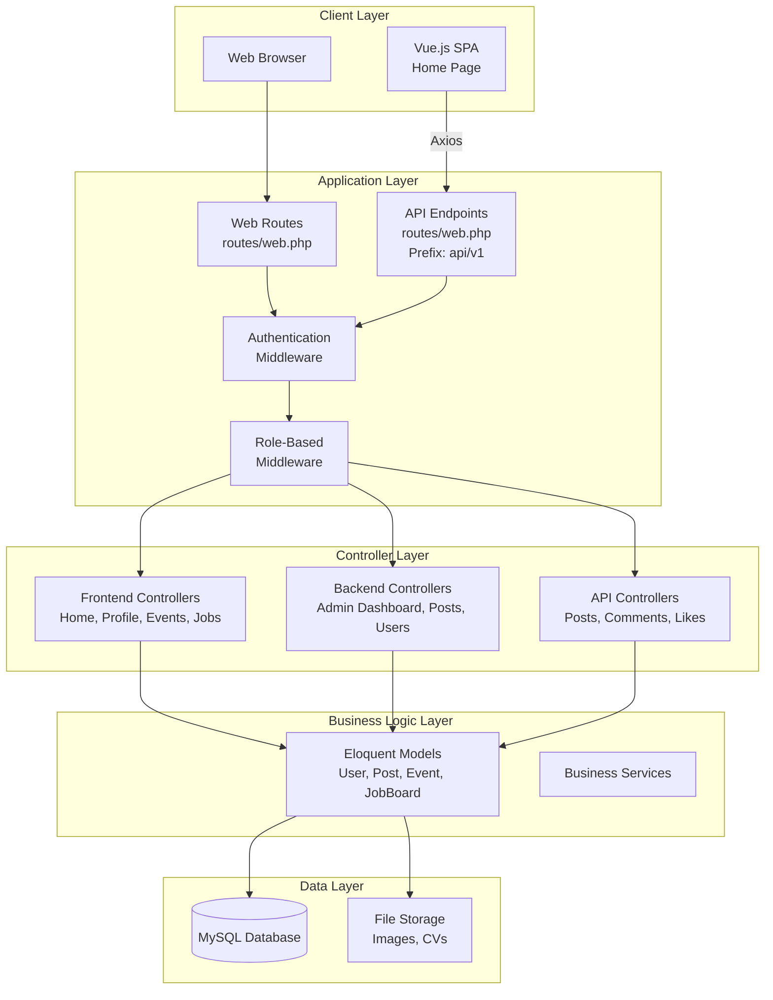

---

## 4. User Authentication Flow

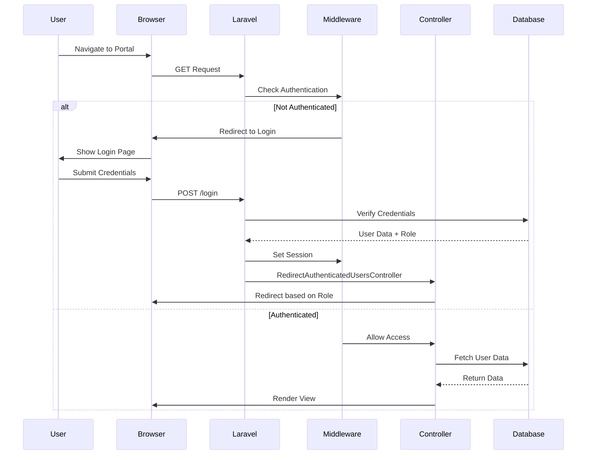

---

## 5. Role-Based Access Control

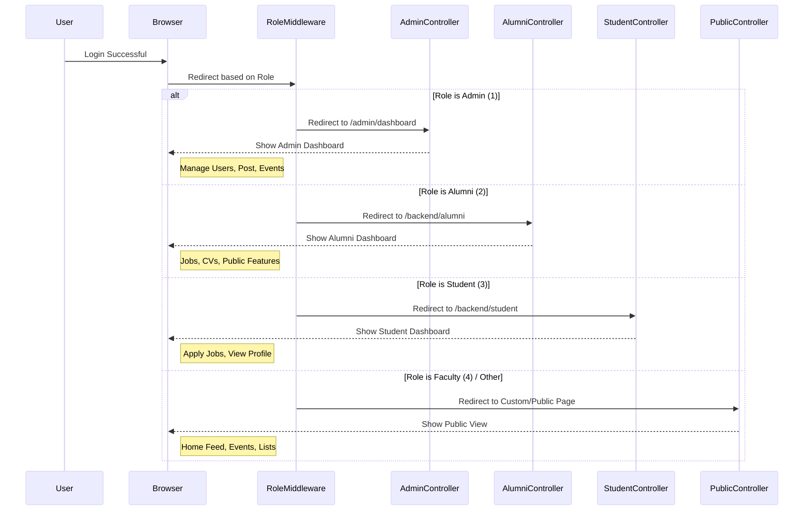

---

## 6. Home Page Request Flow (Vue.js Integration)

### Step 1: User Initiates Request
An authenticated user navigates to the home page and interacts with the Vue.js application.

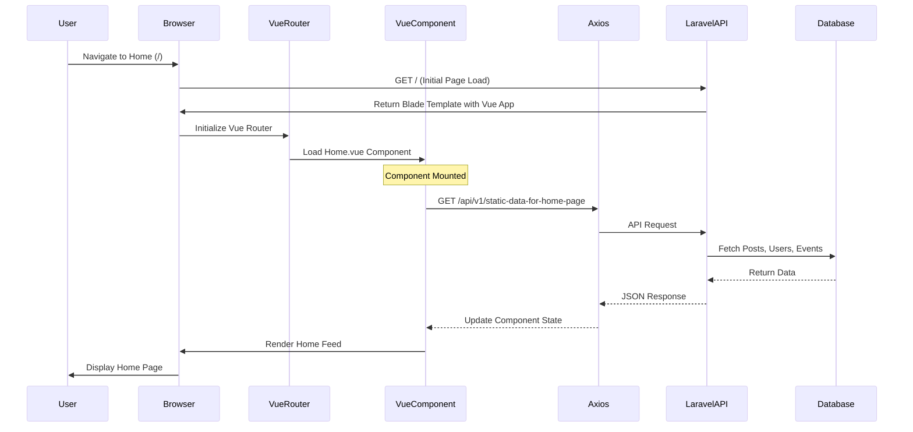

### Step 2: Server-Side Processing
The Laravel backend processes the GET request to `/api/v1/static-data-for-home-page`.

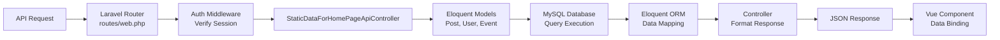

### Step 3: Authentication and Authorization
Laravel middleware verifies the user's authentication status and ensures they have the necessary authorization to access their own profile.

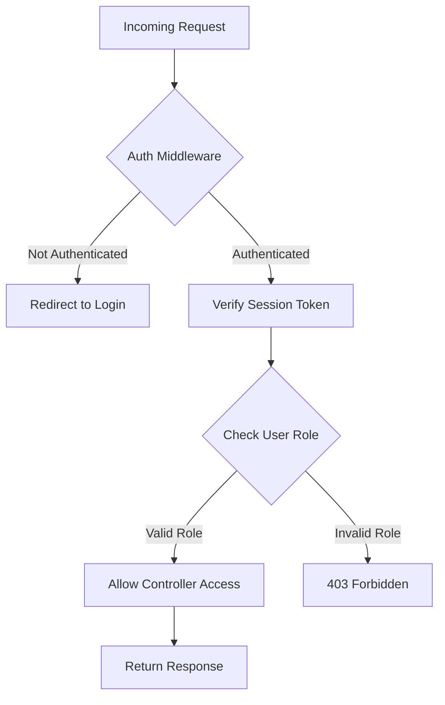

### Step 4: Data Retrieval
The `StaticDataForHomePageApiController` method interacts with the **Eloquent ORM** to fetch the current profile data from the **MySQL Database**.

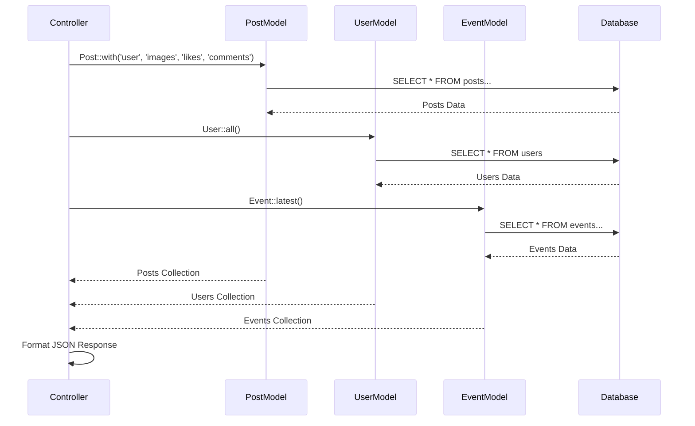

---

## 7. Post Creation Flow (Vue.js to Laravel API)

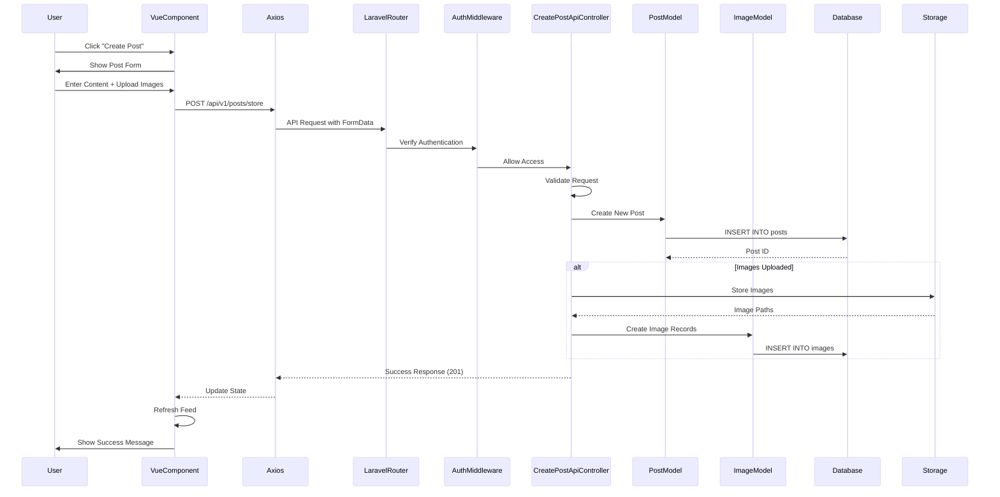

---

## 8. Post Update Flow

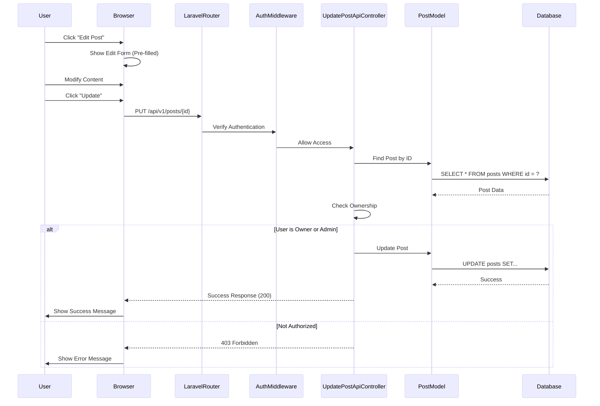

---

## 9. Like/Unlike Flow

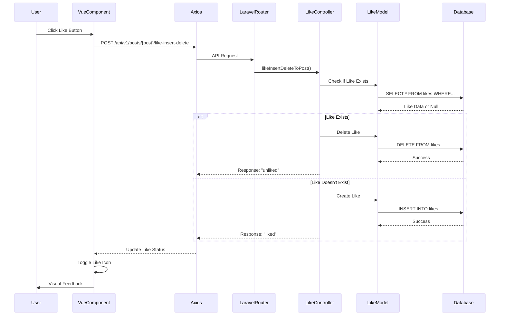

---

## 10. Comment System Flow

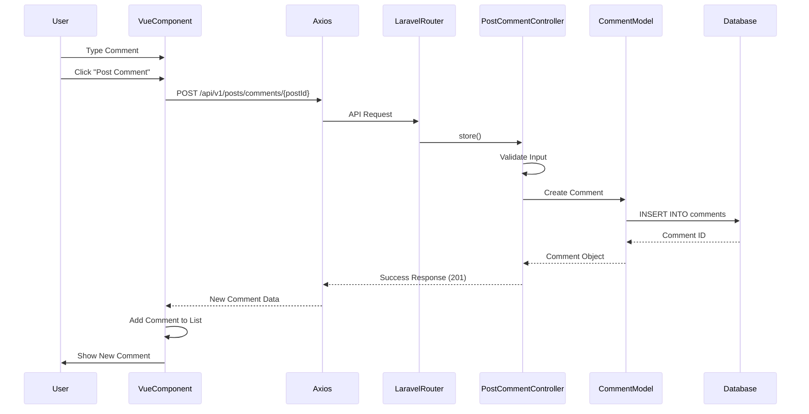

---

## 11. Job Application Flow

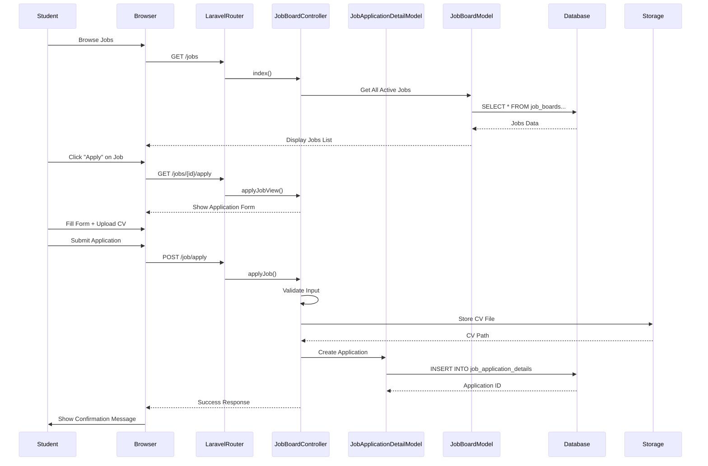

---

## 12. Admin User Management Flow

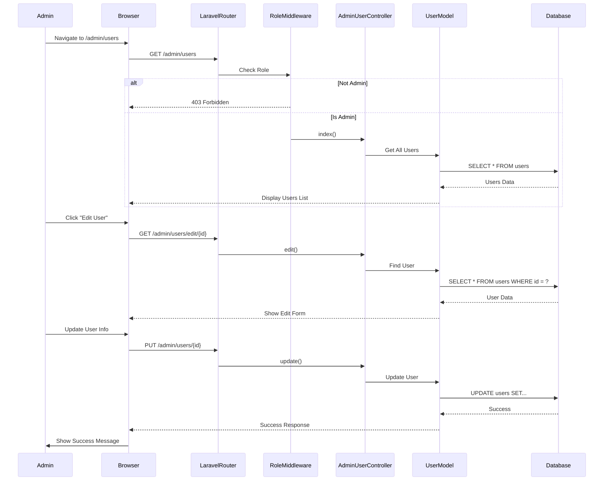

---

## 13. Event Management Flow

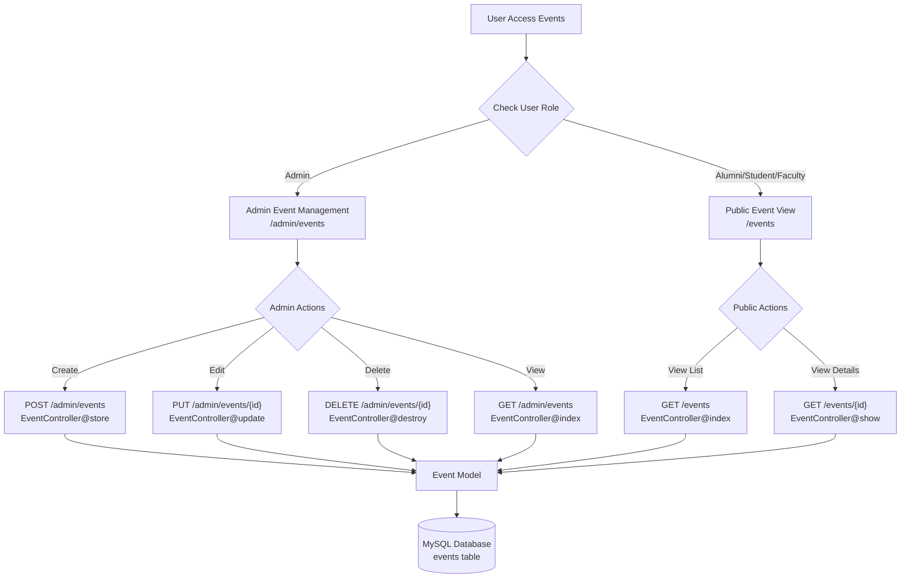

---

## 14. File Upload and Storage Flow

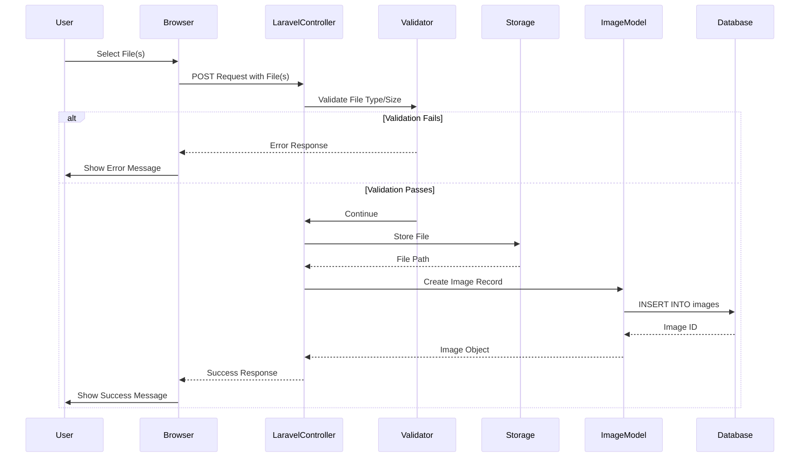

---

## 15. Notification System Flow

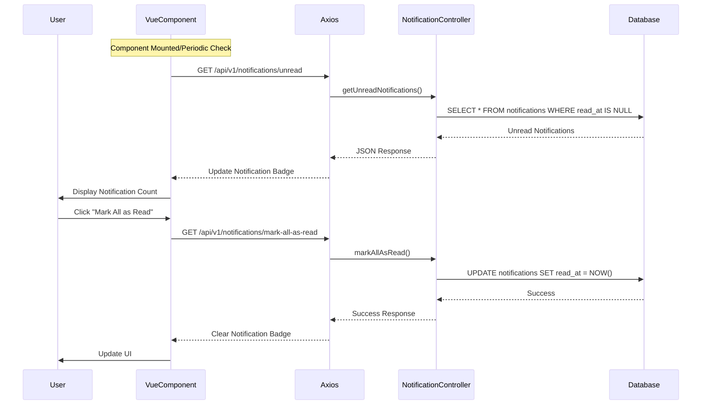

---

## 16. Database Schema Overview

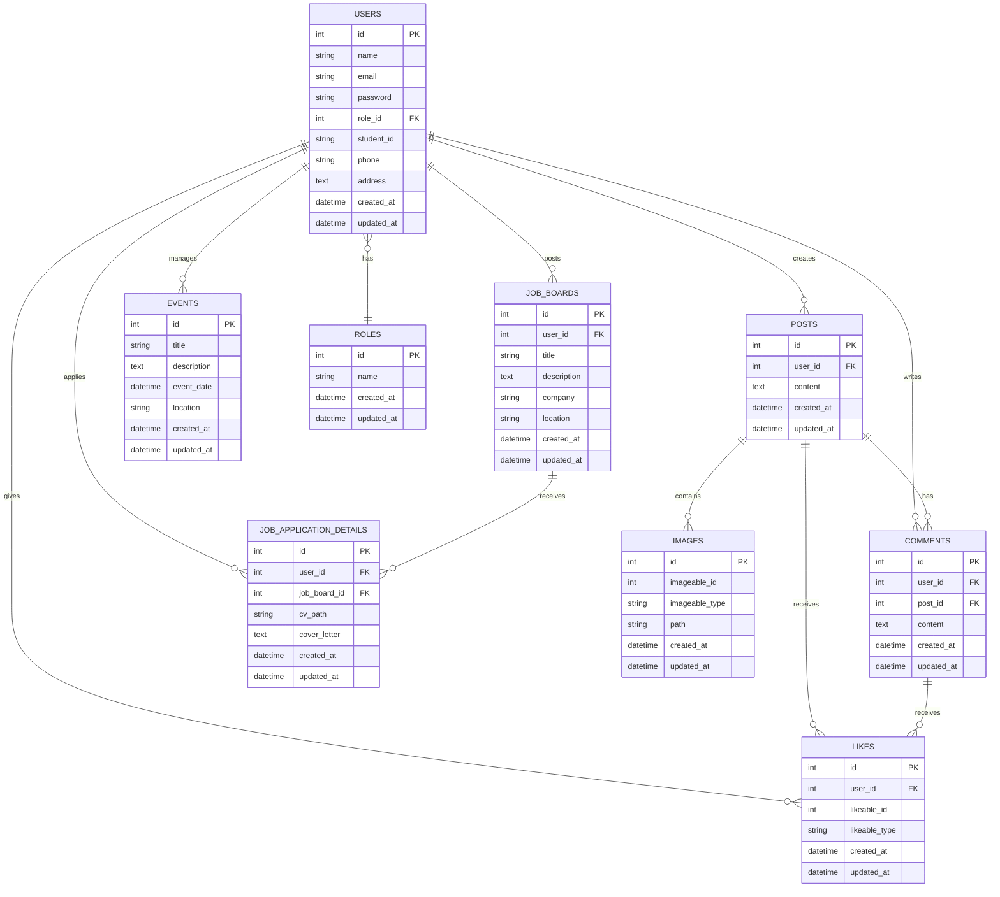

---

## 17. API Endpoints Summary

### Authentication Endpoints
| Method | Endpoint | Controller | Description |
|--------|----------|------------|-------------|
| GET | `/login` | `AuthenticatedSessionController@create` | Show login form |
| POST | `/login` | `AuthenticatedSessionController@store` | Process login |
| POST | `/logout` | `AuthenticatedSessionController@destroy` | Logout user |
| GET | `/register` | `RegisteredUserController@create` | Show registration form |
| POST | `/register` | `RegisteredUserController@store` | Process registration |

### Public Endpoints (Authenticated Users)
| Method | Endpoint | Controller | Description |
|--------|----------|------------|-------------|
| GET | `/` | `HomeController@index` | Home page (Vue.js) |
| GET | `/profile` | `ProfileController@index` | View profile |
| PUT | `/profile/{user_id}` | `ProfileController@update` | Update profile |
| GET | `/events` | `EventController@index` | List events |
| GET | `/alumni-list` | `AlumniListController@index` | List alumni |
| GET | `/student-list` | `StudentListController@index` | List students |
| GET | `/jobs` | `JobBoardController@index` | List jobs |
| POST | `/job/apply` | `JobBoardController@applyJob` | Apply for job |

### API Endpoints (Vue.js - Defined in web.php with Auth Middleware)
**Note**: All API endpoints are defined in `routes/web.php` under the `api/v1` prefix within the auth middleware group.

| Method | Endpoint | Controller | Description |
|--------|----------|------------|-------------|
| GET | `/api/v1/posts` | `PostsApiController` | Get all posts |
| POST | `/api/v1/posts/store` | `CreatePostApiController` | Create post |
| PUT | `/api/v1/posts/{id}` | `UpdatePostApiController` | Update post |
| DELETE | `/api/v1/posts/{id}` | `DeletePostApiController` | Delete post |
| POST | `/api/v1/posts/{post}/like-insert-delete` | `LikeController@likeInsertDeleteToPost` | Toggle like on post |
| GET | `/api/v1/posts/comments/{postId}` | `PostCommentApiController` | Get post comments |
| POST | `/api/v1/posts/comments/{postId}` | `PostCommentController@store` | Create comment |
| PUT | `/api/v1/posts/comments/{id}` | `PostCommentController@update` | Update comment |
| DELETE | `/api/v1/posts/comments/{id}` | `PostCommentController@destroy` | Delete comment |
| POST | `/api/v1/posts/comments/{commentId}/like-insert-delete` | `LikeController@likeInsertDeleteToComment` | Toggle like on comment |
| DELETE | `/api/v1/images/{imageId}` | `ImageDeleteApiController` | Delete image |
| GET | `/api/v1/static-data-for-home-page` | `StaticDataForHomePageApiController` | Get home page data |
| GET | `/api/v1/notifications/unread` | `NotificationController@getUnreadNotifications` | Get unread notifications |
| GET | `/api/v1/notifications/mark-all-as-read` | `NotificationController@markAllAsRead` | Mark all as read |
| GET | `/api/v1/chat/message-count` | `ChatMessageApiController` | Get message count |

### Admin Endpoints
| Method | Endpoint | Controller | Description |
|--------|----------|------------|-------------|
| GET | `/admin/dashboard` | `DashboardController@index` | Admin dashboard |
| GET | `/admin/posts` | `PostController@index` | Manage posts |
| GET | `/admin/users` | `AdminUserController@index` | Manage users |
| GET | `/admin/job-board` | `AdminJobBoardController@index` | Manage jobs |
| GET | `/admin/job-board/applicants-list` | `AdminJobBoardController@applicantsIndexForAdmin` | View applicants |
| GET | `/admin/events` | `Backend\EventController@index` | Manage events |

### Alumni Endpoints
| Method | Endpoint | Controller | Description |
|--------|----------|------------|-------------|
| GET | `/backend/alumni` | `DashboardController@index` | Alumni dashboard |
| GET | `/backend/alumni/job-board` | `AdminJobBoardController@index` | Manage own jobs |
| GET | `/backend/alumni/job-board/applicants` | `AdminJobBoardController@applicantsIndex` | View applicants |
| GET | `/backend/alumni/download-applicants-cv` | `AdminJobBoardController@downloadCV` | Download CVs |

### Student Endpoints
| Method | Endpoint | Controller | Description |
|--------|----------|------------|-------------|
| GET | `/backend/student` | `DashboardController@index` | Student dashboard |
| GET | `/backend/student/job-applications-list` | `DashboardController@jobApplicationList` | View applications |

---

## 18. Middleware Flow

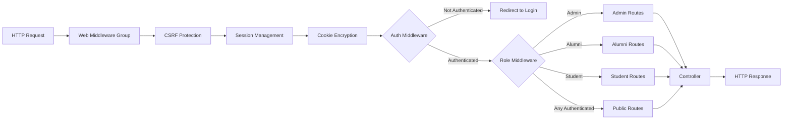

---

## 19. Vue.js Component Structure

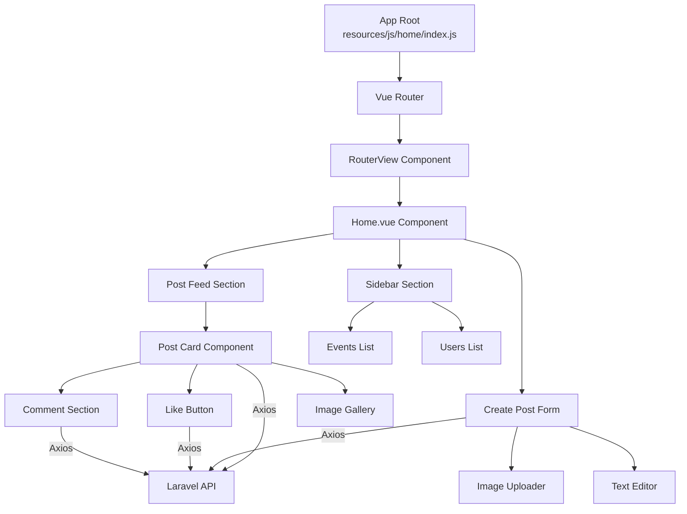

---

## 20. Chat System Flow (Chatify Integration)

The system integrates **Chatify**, a Laravel package, to provide real-time messaging capabilities between users.

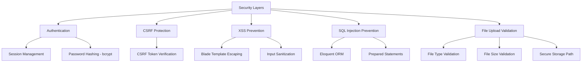

---

## 21. System Working Flow Summary

The following steps describe a widespread service request processed by the Alumni Portal, focusing on a typical user interaction (e.g., viewing the home page flow).

**Step 1: User Initiates Request**: An authenticated user (Alumni or Student) logs into the portal and navigates to the home page or dashboard. The browser sends a `GET` request to the application root `/` or specific route.

**Step 2: Server-Side Routing**: The **Laravel Router** captures the request and directs it to the appropriate controller method (e.g., `HomeController@index` or `DashboardController@index`).

**Step 3: Authentication and Authorization**: **Laravel Middleware** (`auth`, `role`) verifies the user's identity via session cookies and ensures they have the necessary permissions (Admin, Alumni, Student) to access the requested resource.

**Step 4: Data Retrieval (Server-Side)**: For non-SPA pages, the controller interacts with **Eloquent Models** (e.g., `User`, `JobBoard`) to fetch data directly from the **MySQL Database**.

**Step 5: View Rendering / SPA Initialization**: 
   - **Blade**: For standard pages, Laravel renders a Blade template populated with data and returns HTML.
   - **Vue.js**: For the Home Page, Laravel returns a skeleton Blade template that initializes the **Vue.js Application**.

**Step 6: Client-Side Data Fetching (Vue.js)**: If utilizing Vue.js, the component mounts and triggers an **Axios** `GET` request to API endpoints (e.g., `/api/v1/static-data-for-home-page`).

**Step 7: API Processing**: The request hits `routes/web.php` (API prefix). Middleware re-verifies auth. The **API Controller** fetches fresh data (Posts, Events, Users) from the database and returns a **JSON Response**.

**Step 8: Dynamic UI Update**: The Vue.js component receives the JSON data and dynamically updates the DOM to display posts, comments, and events without a page reload.

**Step 9: User Interaction**: The user interacts with the page (e.g., creating a post, applying for a job, chatting). These actions trigger new **POST/PUT** requests, repeating the cycle of Routing -> Auth -> Controller Logic -> Database Update -> JSON/HTML Response.

---

## 22. Request Lifecycle Summary

### For Blade-Rendered Pages:
1. **User Request** → Browser sends HTTP request
2. **Routing** → Laravel Router matches route in `routes/web.php`
3. **Middleware** → Authentication and Role-based middleware checks
4. **Controller** → Controller method processes request
5. **Model** → Eloquent ORM queries database
6. **View** → Blade template rendered with data
7. **Response** → HTML sent back to browser

### For Vue.js API Requests:
1. **User Interaction** → User interacts with Vue component (e.g., clicks like, posts comment)
2. **Axios Request** → Vue component sends HTTP request via Axios to `/api/v1/*` endpoint
3. **Routing** → Laravel Router matches route in `routes/web.php` under `api/v1` prefix
4. **Middleware** → Auth middleware validates session (user must be logged in)
5. **API Controller** → Controller processes API request (e.g., `PostsApiController`, `LikeController`)
6. **Model** → Eloquent ORM queries database (e.g., `Post::all()`, `Like::create()`)
7. **JSON Response** → Controller returns JSON data (e.g., `return response()->json(['data' => $posts])`)
8. **Vue Update** → Axios receives response, Vue component updates reactive data
9. **UI Update** → Browser re-renders component with new data (no page reload)

---

## 21. Security Measures

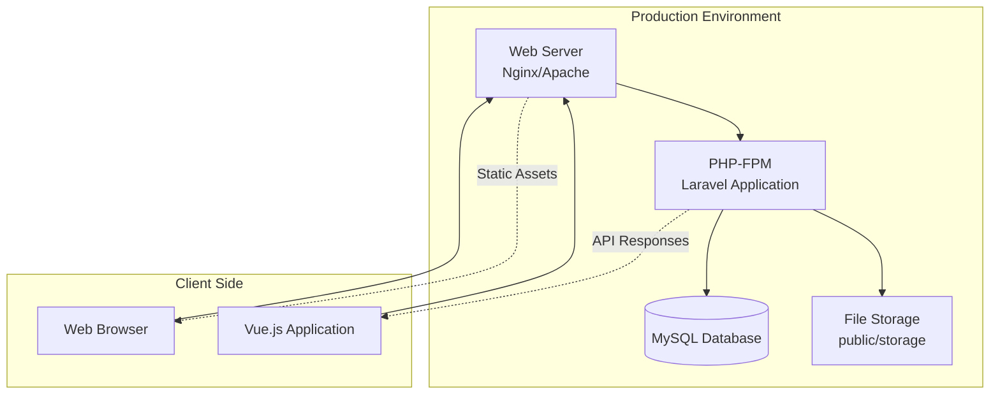

---

## 22. Deployment Architecture

---

## 23. Key Features Summary

### Admin Features
- ✅ User Management (View, Edit Users)
- ✅ Post Management (View, Edit, Delete Posts)
- ✅ Event Management (Create, Edit, Delete Events)
- ✅ Job Board Management (View, Edit, Delete Jobs)
- ✅ View All Job Applicants
- ✅ Download Applicant CVs

### Alumni Features
- ✅ Post Job Opportunities
- ✅ View Applicants for Own Jobs
- ✅ Download CVs
- ✅ Manage Own Job Postings

### Student Features
- ✅ Apply for Jobs
- ✅ View Own Job Applications
- ✅ Upload CV

### Common Features (All Authenticated Users)
- ✅ View Home Feed (Vue.js)
- ✅ Create Posts with Images
- ✅ Edit/Delete Own Posts
- ✅ Like Posts and Comments
- ✅ Comment on Posts
- ✅ View Events
- ✅ View Alumni List
- ✅ View Student List
- ✅ Profile Management
- ✅ Notifications
- ✅ Real-time Updates (Vue.js)

---

## 24. Technology Integration Points

### Laravel + Vue.js Integration

### Asset Compilation
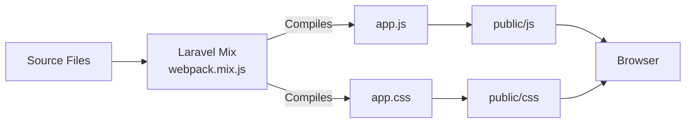

---

## Conclusion

This document provides a comprehensive overview of the GUB Alumni Portal's system architecture and working flow. The application leverages Laravel's robust backend capabilities combined with Vue.js for a dynamic, interactive home page experience. The role-based access control ensures that different user types (Admin, Alumni, Student) have appropriate access to features and data.

**Key Strengths:**
- Clear separation of concerns (MVC architecture)
- RESTful API design for Vue.js integration
- Role-based access control
- Secure authentication and authorization
- Scalable database design
- Modern frontend with Vue.js

**For Development:**
- Follow Laravel best practices
- Maintain consistent API response formats
- Implement proper error handling
- Write comprehensive tests
- Document API endpoints
- Keep dependencies updated
